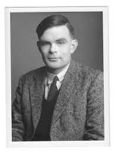

 Nama :Moh Zainal Arifin
<td>Nim :1821500022</td>

<h1>1. Alan Mathison Turing</h1>

> Alan Mathison Turing ( 23 Juni 1912 - 7 Juni 1954 ) adalah "bapak" komputer digital. Dia adalah seorang ahli matematika dan ilmuwan komputer. Dia mengembangkan ide Mesin Turing , sebuah sistem aturan dan hukum, pada tahun 1936. Dia menemukan Tes Turing , ketika komputer mencoba tampil sebagai manusia. Selama Perang Dunia II , Turing adalah seorang cracker. Dia bekerja di Bletchley Park di Inggris dan memecahkan Mesin Enigma Jerman. Masyarakat dan pemerintah Inggris telah memberikan nama buruk Thuring karena homoseksualitasnya . Pada tahun 1952, dia mengaku bersalah berhubungan seks dengan seorang pria. Dia memiliki pilihan antara hukuman penjara atau pengebirian kimia. Dia memilih tempat. Pengaruh pengebirian adalah ketidakmampuan dan ia menjadi embrio. Setelah dua tahun hidup dengan efek ini, Turing bunuh diri. Pada 2009 , Inggris Perdana Menteri Gordon Brown meminta maaf kepada keluarga Turing untuk pengobatannya. The Policing and Crime Act 2017 memaafkan semua yang bersalah atas pelanggaran yang sama "ketidaksenonohan" seperti Turing di Inggris dan Wales. Itu sering disebut "Hukum Alan Thuring", meskipun Turing adalah salah satu orang paling terkenal yang harus disalahkan.

<h2>2. Dinamycal System and its Applications</h2>
Sistem yang menggambarkan sesuatu yang berbentuk dinamis yang berubah terhadap waktu tapi dinamik yang dipakai pada praktek yang dimodelkan,dan dianalisa tidak berfungsi dari itu saja tapi juga bisa fungsi dari ruang.Yang kita analisa seakan-akan itu fungsinya.Contoh,sudut simpang bandul dari sudut tegak lurus sebagai peta maka dengan prinsip newton.kita bisa mendapatkannya dengan F = gaya itu sama dengan massa dikalikan percepatan,percepatan itu adalah pos yang menarik bandulnya,akhirnya minus MG Sin Teta ini sama dengan percepatan,disaat yang sama maka kita bisa menghitung pakai rumus kalkulus 2.Berapa panjang Lintasan adalah I dengan I adalah panjang dari tali,sedangkan S adalah jarak yang ditempuh,maka percepatannya menjadi turunan ke-2.Kalau sudut simpang kecil maka Sin Teta.Dengan peta solusinya adalah a sin a + b 

